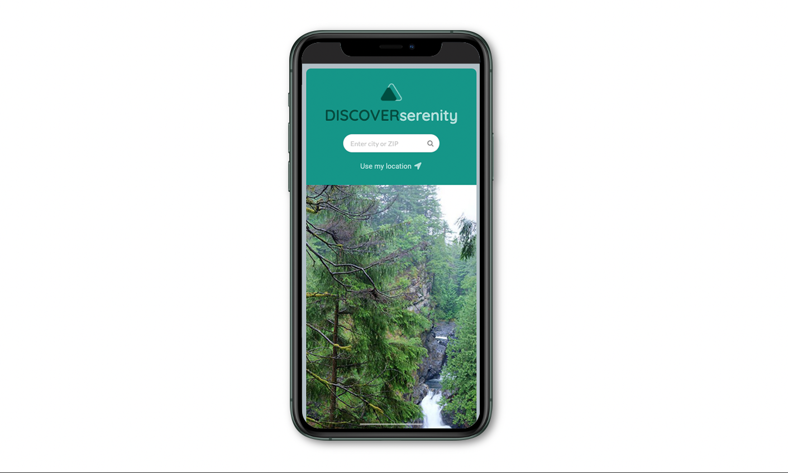

## Project Description

The Covid-19 pandemic has reshaped every aspect of our lives and a "new normal" way to experience the world with safety has been established.

**DISCOVER Serenity** is a web application that provides its users with the best hiking trail options in the United States, avoiding crowds and therefore easier to find serenity outdoors. This new app provides updated and reliable information on hiking trails with fewer people and fewer health risks.


## Application Concept

"Find a hiking trail with fewer COVID-19 risks while still finding the most beautiful places that nature has to offer!"

Outdoor activities are an important aspect of life, people want to take a break from home and refresh their body and mind without feeling exposed to the novel Coronavirus. Considering this need we created **DISCOVER Serenity**, a powerful and accessible solution to enjoy nature safely.

## User Story

- As an outdoor enthusiast
- I want to find open trails that aren’t crowded 
- So that I find serenity outdoors without worrying about health concerns


## Application Features

Deployment url: https://calebkirkish.github.io/discover-serenity/

```

• Users can start a search by input the city or ZIP
• Users can also provide their location for a search
• The results will be displayed in visually curated tiles
• Trails are sorted in order of popularity, giving users potentially less crowded options first
• Trails displayed are no longer than 15 miles in length
• Every tile provides for initial parameters:

  1. Trail name 
  2. COVID-19 Factor
  3. Popularity
  4. County

• Every tile expands with a click and provides more detailed information such as:

  5. Trail length
  6. Difficulty level
  7. Location (county and state)
  8. Summary (A brief description of the place)

• Special feature:

  9. Learn More button that connects to a map and more information on the  Hiking Project website
  
```


## Application Preview




## Technology & Framework

- CSS Grid
- CSS Variables
- Semantic UI
- jQuery to create dynamic content
- Responsive design across viewports
- Google fonts & Font Awesome
- Geolocation web API


## Featured APIs

1. [Google Maps Geocoding API](https://developers.google.com/maps/documentation/geocoding/overview) 
2. [REI Hiking Project API](https://www.hikingproject.com/data)
3. [COVID-19 API](https://covid19-us-api.herokuapp.com/redoc)


## Future Features

```

• Allow user to choose search parameter, filtering options, and a radius for hikes
• Give users the ability to see more hikes
• Estimate drive times if using "user location"
• About page (how the site works, how to be outdoors safely, etc.)
• Results outside of the US
• Store COVID data in a database to help give more accurate data
• Tile background on landing
• Add trail maps and current weather
• Add social media interaction and user reviews

```
__________

